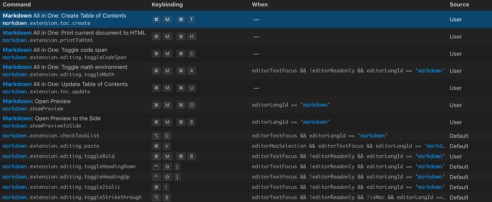

## Anya L. Keller's Git Branch Tracker

##### Project: Star Treck Word Guessing Game for Columbia Bootcamp

Table of Contents

- [Anya L. Keller's Git Branch Tracker](#anya-l-kellers-git-branch-tracker)
      - [Project: Star Treck Word Guessing Game for Columbia Bootcamp](#project-star-treck-word-guessing-game-for-columbia-bootcamp)
  - [Shortcuts for Markdown All in One Extention](#shortcuts-for-markdown-all-in-one-extention)
  - [Git Branch Cheat Sheet](#git-branch-cheat-sheet)
        - [Main Git branch Commands](#main-git-branch-commands)
  - [Log Format Template:](#log-format-template)
- [LOG](#log)
      - [July 23, 2019 ~ 14:00 - Branches: 2](#july-23-2019--1400---branches-2)
      - [July 23, 2019 - 14:15 - Branches: 2](#july-23-2019---1415---branches-2)

### Shortcuts for Markdown All in One Extention



### Git Branch Cheat Sheet

[Github SCM Branch Cheat Sheet Link](https://git-scm.com/book/en/v2/Git-Branching-Basic-Branching-and-Merging)

###### Main Git branch Commands

```zsh
# switch to branch
$ git checkout [branch name]
# Create and switch to [branch name]
$ git checkout -b [Branch Name]
```

```zsh
# add and commit change
$ git commit -a -m '[Commit msg]'
```

```zsh
# switch to master
$ git checkout master
# Merge in changed branch
$ git merge [branch name]
# delete the branch
$ git branch -d [branch name]
```

```zsh
# from branch that is ahead, to updae it and merge changes in master
$ git merge master
# TIP: the idea is that you run git merge [branch name] to merge that branch into the one you are currently in
```

### Log Format Template:

```markdown
##### [as of date] - Branches: [number of branches]

1.  MASTER
2.  [Branch 2] - description
3.  [Branch etc...] - description
```

---

## LOG

##### July 23, 2019 ~ 14:00 - Branches: 2

1. MASTER
2. gridtesting

##### July 23, 2019 - 14:15 - Branches: 2

1. MASTER
2. bootstraplayout
